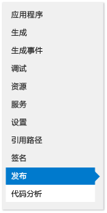
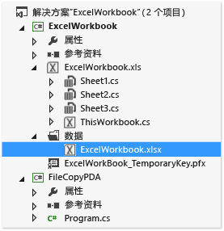
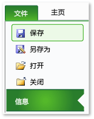
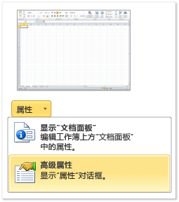

# <a name="deploying-an-office-solution-by-using-clickonce"></a>使用 ClickOnce 部署 Office 解决方案
  如果使用 ClickOnce，则部署 Office 解决方案的步骤更少。 如果发布更新，解决方案将自动检测并安装更新。 不过，ClickOnce 需要你分别为计算机的每个用户安装解决方案。 因此，如果有多个用户将在同一计算机上运行你的解决方案，应考虑使用 Windows Installer (.msi)。  
  
## <a name="in-this-topic"></a>在本主题中  
  
-   [发布解决方案](#Publish)  
  
-   [决定你想要向解决方案授予信任](#Trust)  
  
-   [帮助用户安装解决方案](#Helping)  
  
-   [将解决方案文档置于最终用户的计算机上 （仅文档级自定义）](#Put)  
  
-   [将解决方案文档置于运行 SharePoint （仅文档级自定义） 的服务器](#SharePoint)  
  
-   [创建自定义安装程序](#Custom)  
  
-   [发布更新](#Update)  
  
-   [更改解决方案的安装位置](#Location)  
  
-   [解决方案回滚到早期版本](#Roll)  
  
 有关如何通过创建 Windows Installer 文件部署 Office 解决方案的详细信息，请参阅[部署 Office 解决方案使用 Windows installer](../vsto/deploying-an-office-solution-by-using-windows-installer.md)。  
  
##  <a name="Publish"></a>发布解决方案  
 你可以通过使用发布你的解决方案**发布向导**或**项目设计器**。 在此过程中，你将使用**项目设计器**因为它提供了一组完整的发布选项。 请参阅[发布向导 &#40; 的 Office 开发中 Visual Studio &#41;](../vsto/publish-wizard-office-development-in-visual-studio.md)。  
  
#### <a name="to-publish-the-solution"></a>发布解决方案  
  
1.  在**解决方案资源管理器**，选择为你的项目名为的节点。  
  
2.  在菜单栏上，选择**项目**， *ProjectName* **属性**。  
  
3.  在**项目设计器**，选择**发布**选项卡上，如下图所示。  
  
       
  
4.  在**发布文件夹位置 （ftp 服务器或者文件路径）**框中，输入想在其中的文件夹的路径**项目设计器**从中复制解决方案文件。  
  
     可以输入以下任一类型的路径。  
  
    -   本地路径 (例如， *C:\FolderName\FolderName*)。  
  
    -   到你的网络上的文件夹的通用命名约定 (UNC) 路径 (例如，  *\\\ServerName\FolderName*)。  
  
    -   相对路径 (例如， *PublishFolder\\*，这是默认情况下在其中发布项目的文件夹)。  
  
5.  在**安装文件夹 URL**框中，输入最终用户将从中查找解决方案的位置的完全限定的路径。  
  
     如果你不知道位置，不此字段中输入任何内容。 默认情况下，ClickOnce 将在用户从中安装解决方案的文件夹中查找更新。  
  
6.  选择 **“系统必备”** 按钮。  
  
7.  在**先决条件**对话框框中，确保**创建用于安装系统必备组件安装程序**复选框处于选中状态。  
  
8.  在**选择要安装的必备组件**列表中，选择对应的复选框**Windows Installer 4.5**和相应的.NET Framework 包。  
  
     例如，如果你的解决方案面向[!INCLUDE[net_v45](../vsto/includes/net-v45-md.md)]，选择对应的复选框**Windows Installer 4.5**和**Microsoft.NET Framework 4.5 Full**。  
  
9. 如果你的解决方案面向.NET Framework 4.5，则还要选择**Visual Studio 2010 Tools for Office Runtime**复选框。  
  
    > [!NOTE]  
    >  默认情况下，不显示此复选框。 若要显示此复选框，必须创建引导程序包。 请参阅[使用 Visual Studio 2012 创建引导程序包 for Office 2013 VSTO 外接程序](http://blogs.msdn.com/b/vsto/archive/2012/12/21/creating-a-bootstrapper-package-for-an-office-2013-vsto-add-in-with-visual-studio-2012.aspx)。  
  
10. 下**指定系统必备组件的安装位置**，选择其中一个选项，显示，然后选择**确定**按钮。  
  
     下表对每个选项进行了描述。  
  
    |选项|描述|  
    |------------|-----------------|  
    |**从组件供应商的网站下载系统必备组件**|系统将提示用户从供应商处下载并安装这些系统必备组件。|  
    |**从与我的应用程序相同的位置下载系统必备组件**|系统必备软件与解决方案一起安装。 如果选择此选项，Visual Studio 会将所有系统必备组件包为你复制到发布位置。 要让此选项正常工作，系统必备包必须位于开发计算机上。|  
    |**从下列位置下载系统必备组件**|Visual Studio 将所有系统必备组件包复制到你指定的位置，并与解决方案一起安装。|  
  
     请参阅[系统必备组件对话框](/visualstudio/ide/reference/prerequisites-dialog-box)。  
  
11. 选择**更新**按钮，指定你希望每个最终用户的 VSTO 外接程序或自定义项检查更新，然后选择多久**确定**按钮。  
  
    > [!NOTE]  
    >  如果要使用 CD 或可移动驱动器进行部署，选择**从不检查更新**选项按钮。  
  
     有关如何发布更新的信息，请参阅[发布更新](#Update)。  
  
12. 选择**选项**按钮，查看中的选项**选项**对话框中，，然后选择**确定**按钮。  
  
13. 选择**立即发布**按钮。  
  
     Visual Studio 将向你先前在此过程中指定的发布文件夹添加以下文件夹和文件。  
  
    -   **应用程序文件**文件夹。  
  
    -   安装程序。  
  
    -   部署清单，指向最新版本的部署清单。  
  
     **应用程序文件**文件夹包含你发布的每个版本的子文件夹。 每个特定于版本的子文件夹均包含以下文件。  
  
    -   应用程序清单。  
  
    -   部署清单。  
  
    -   自定义程序集。  
  
     下图显示了 Outlook VSTO 外接程序的发布文件夹的结构。  
  
       
  
    > [!NOTE]  
    >  ClickOnce 将.deploy 扩展名附加到程序集，这样，受保护的安装的 Internet 信息服务 (IIS) 不会由于不安全的扩展而阻止文件。 在用户安装解决方案后，ClickOnce 将移除 .deploy 扩展名。  
  
14. 将解决方案文件复制到你先前在此过程中指定的安装位置。  
  
##  <a name="Trust"></a>决定你想要向解决方案授予信任  
 要让解决方案在用户计算机上运行，你必须授予信任，或用户必须在安装解决方案时响应信任提示。 要向解决方案授予信任，请使用能识别已知受信任发布者的证书为清单签名。 请参阅[向解决方案授予信任的签名的应用程序和部署清单](../vsto/granting-trust-to-office-solutions.md#Signing)。  
  
 如果要部署的文档级自定义项，并且你想要将放置文件夹的用户的计算机上的文档或使文档在 SharePoint 站点上可用，请确保 Office 信任文档的位置。 请参阅[向文档授予信任](../vsto/granting-trust-to-documents.md)。  
  
##  <a name="Helping"></a>帮助用户安装解决方案  
 用户可通过运行安装程序、打开部署清单（或对于文档集自定义项，直接打开文档）来安装解决方案。 作为最佳做法，用户应使用安装程序来安装解决方案。 其他两种方法不能确保安装必备软件。 如果用户希望从安装位置打开文档，则必须将此文档添加到 Office 应用程序信任中心的受信任位置列表。  
  
### <a name="opening-the-document-of-a-document-level-customization"></a>打开文档级自定义项的文档  
 若要打开文档集自定义项的文档，用户可以直接将其从安装位置打开，也可以将此文档复制到本地计算机并打开副本。  
  
 作为最佳做法，用户应打开其计算机上的文档副本，这样，多个用户不会同时尝试打开同一文档。 要实施此做法，可以将安装程序配置为将文档复制到用户计算机。 请参阅[将解决方案文档置于最终用户的计算机上 （仅文档级自定义）](#Put)。  
  
### <a name="installing-the-solution-by-opening-the-deployment-manifest-from-an-iis-website"></a>通过从 IIS 网站打开部署清单来安装解决方案  
 用户可以通过从 Web 打开部署清单来安装 Office 解决方案。 但是，受保护的 Internet Information Services (IIS) 安装将阻止具有 .vsto 扩展名的文件。 要使用 IIS 来部署 Office 解决方案，必须在 IIS 中定义 MIME 类型。  
  
##### <a name="to-add-the-vsto-mime-type-to-iis-60"></a>向 IIS 6.0 添加 .vsto MIME 类型  
  
1.  在服务器上运行 IIS 6.0，选择**启动**，**所有程序**，**管理工具**， **Internet Information Services (IIS) Manager**.  
  
2.  选择计算机名称，**网站**文件夹或要配置的网站。  
  
3.  在菜单栏上，选择**操作**，**属性**。  
  
4.  上**HTTP 标头**选项卡上，选择**MIME 类型**按钮。  
  
5.  在**MIME 类型**窗口中，选择**新建**按钮。  
  
6.  在**MIME 类型**窗口中，输入**.vsto**作为扩展名，并输入**应用程序/x 的 ms vsto**作为 MIME 类型，，然后应用新设置。  
  
    > [!NOTE]  
    >  为使更改生效，必须重新启动万维网发布服务或者等待工作进程回收。 随后，必须刷新浏览器的磁盘缓存，并尝试再次打开 .vsto 文件。  
  
##### <a name="to-add-the-vsto-mime-type-to-iis-70"></a>向 IIS 7.0 添加 .vsto MIME 类型  
  
1.  在服务器上运行 IIS 7.0，选择**启动**，**所有程序**，**附件**。  
  
2.  打开的快捷菜单**命令提示符**，然后选择**以管理员身份运行。**  
  
3.  在**打开**框中，输入下面的路径，然后选择**确定**按钮。  
  
    ```  
    %windir%\system32\inetsrv   
    ```  
  
4.  输入以下命令，然后应用新设置。  
  
    ```  
    set config /section:staticContent /+[fileExtension='.vsto',mimeType='application/x-ms-vsto']  
    ```  
  
    > [!NOTE]  
    >  为使更改生效，必须重新启动万维网发布服务或者等待工作进程回收。 随后，必须刷新浏览器的磁盘缓存，并尝试再次打开 .vsto 文件。  
  
##  <a name="Put"></a>将解决方案文档置于最终用户的计算机上 （仅文档级自定义）  
 通过创建后期部署操作，你可以为其复制到最终用户的计算机上你解决方案的文档。 这样一来，用户不需要手动将文档复制从安装位置到其计算机后用户安装解决方案。 你将需要创建定义后期部署操作的类、 生成和发布解决方案，修改应用程序清单和应用程序和部署清单进行重新签名。  
  
 下面的过程假定项目名称即**ExcelWorkbook**并将其发布到解决方案**C:\publish**目录在你的计算机上。  
  
### <a name="create-a-class-that-defines-the-post-deployment-action"></a>创建定义后期部署操作的类  
  
1.  在菜单栏上，依次选择 **“文件”**、 **“添加”**、 **“新建项目”**。  
  
2.  在**添加新项目**对话框中，在**已安装的模板**窗格中，选择**Windows**文件夹。  
  
3.  在**模板**窗格中，选择**类库**模板。  
  
4.  在**名称**字段中，输入**FileCopyPDA**，然后选择**确定**按钮。  
  
5.  在**解决方案资源管理器**，选择**FileCopyPDA**项目。  
  
6.  在菜单栏上，依次选择“项目”、“添加引用”。  
  
7.  上**.NET**选项卡上，添加对 Microsoft.VisualStudio.Tools.Applications.Runtime 和 microsoft.visualstudio.tools.applications.serverdocument 的引用。  
  
8.  将类重命名为 `FileCopyPDA`，然后使用代码替换文件内容。 这段代码执行下列任务：  
  
    -   将文档复制到用户桌面。  
  
    -   从相对路径的 _AssemblyLocation 属性更改为部署清单的完全限定路径。  
  
    -   如果用户卸载此解决方案，则删除该文件。  
  
     [!code-vb[Trin_ExcelWorkbookPDA#7](../vsto/codesnippet/VisualBasic/trin_excelworkbookpda/filecopypda/class1.vb#7)]
     [!code-csharp[Trin_ExcelWorkbookPDA#7](../vsto/codesnippet/CSharp/trin_excelworkbookpda/filecopypda/class1.cs#7)]  
  
### <a name="build-and-publish-the-solution"></a>生成并发布解决方案  
  
1.  在**解决方案资源管理器**，打开快捷菜单**FileCopyPDA**项目，，然后选择**生成**。  
  
2.  打开的快捷菜单**ExcelWorkbook**项目，，然后选择**生成**。  
  
3.  打开的快捷菜单**ExcelWorkbook**项目，，然后选择**添加引用**。  
  
4.  在**添加引用**对话框框中，选择**项目**选项卡上，选择**FileCopyPDA**，然后选择**确定**按钮。  
  
5.  在**解决方案资源管理器**，选择**ExcelWorkbook**项目。  
  
6.  在菜单栏上依次选择**项目**，**新文件夹**。  
  
7.  Enter**数据**，然后选择 Enter 键。  
  
8.  在**解决方案资源管理器**，选择**数据**文件夹。  
  
9. 在菜单栏上，选择**项目**，**添加现有项**。  
  
10. 在**添加现有项**对话框中，浏览到输出目录**ExcelWorkbook**项目，选择**ExcelWorkbook.xlsx**文件，然后依次**添加**按钮。  
  
11. 在**解决方案资源管理器**选择**ExcelWorkbook.xlsx**文件。  
  
12. 在**属性**窗口中，更改**生成操作**属性**内容**和**复制到输出目录**属性**如果较新则复制**。  
  
     当完成这些步骤后时，你的项目将与下图类似。  
  
       
  
13. 发布**ExcelWorkbook**项目。  
  
### <a name="modify-the-application-manifest"></a>修改应用程序清单  
  
1.  打开**c:\publish**目录使用**文件资源管理器**。  
  
2.  打开**应用程序文件**文件夹，然后打开对应于最新的文件夹的最新发布版本你的解决方案。  
  
3.  打开**ExcelWorkbook.dll.manifest**在文本编辑器 （如记事本） 中的文件。  
  
4.  在 `</vstav3:update>` 元素之后添加以下代码。 类特性`<vstav3:entryPoint>`元素，使用以下语法： *NamespaceName.ClassName*。 在以下示例中，命名空间和类名称相同，因此生成的入口点名称为 `FileCopyPDA.FileCopyPDA`。  
  
    ```  
    <vstav3:postActions>  
      <vstav3:postAction>  
        <vstav3:entryPoint  
          class="FileCopyPDA.FileCopyPDA">  
          <assemblyIdentity  
            name="FileCopyPDA"  
            version="1.0.0.0"  
            language="neutral"  
            processorArchitecture="msil" />  
        </vstav3:entryPoint>  
        <vstav3:postActionData>  
        </vstav3:postActionData>  
      </vstav3:postAction>  
    </vstav3:postActions>  
    ```  
  
### <a name="re-sign-the-application-and-deployment-manifests"></a>对应用程序清单和部署清单进行重新签名  
  
1.  在**%USERPROFILE%\Documents\Visual Studio 2013 \ projects\excelworkbook\excelworkbook**文件夹中，复制**ExcelWorkbook_TemporaryKey.pfx**证书文件，并将其粘贴到*PublishFolder* **\Application Files\ExcelWorkbook**\__MostRecentPublishedVersion_文件夹。
  
2.  打开 Visual Studio 命令提示符，然后再将目录更改为**c:\publish\Application Files\ExcelWorkbook**\__MostRecentPublishedVersion_文件夹 (例如， **c:\publish\Application Files\ExcelWorkbook_1_0_0_4**)。  
  
3.  通过运行以下命令对修改的应用程序清单进行签名：  
  
    ```  
    mage -sign ExcelWorkbook.dll.manifest -certfile ExcelWorkbook_TemporaryKey.pfx  
    ```  
  
     将出现“ExcelWorkbook.dll.manifest 已成功签名”消息。  
  
4.  将更改为**c:\publish**文件夹，然后更新并登录部署清单通过运行以下命令：  
  
    ```  
    mage -update ExcelWorkbook.vsto -appmanifest "Application Files\Ex  
    celWorkbookMostRecentVersionNumber>\ExcelWorkbook.dll.manifest" -certfile "Application Files\ExcelWorkbookMostRecentVersionNumber>\ExcelWorkbook_TemporaryKey.pfx"  
    ```  
  
    > [!NOTE]  
    >  在前面的示例，请将 MostRecentVersionNumber 替换为你的解决方案的最新发布版本的版本号 (例如， **1_0_0_4**)。  
  
     将出现“ExcelWorkbook.vsto 已成功签名”消息。  
  
5.  将 ExcelWorkbook.vsto 文件复制到**c:\publish\Application Files\ExcelWorkbook**\__MostRecentVersionNumber_目录。  
  
##  <a name="SharePoint"></a>将解决方案文档置于运行 SharePoint （仅文档级自定义） 的服务器  
 可以使用 SharePoint 将文档级自定义项发布到最终用户。 当用户转到 SharePoint 站点并打开文档时，运行时会将解决方案从共享网络文件夹自动安装到用户的本地计算机。 将解决方案安装到本地后，即使将文档复制到其他位置（例如桌面），自定义项仍可正常工作。  
  
#### <a name="to-put-the-document-on-a-server-thats-running-sharepoint"></a>将文档置于运行 SharePoint 的服务器上  
  
1.  将解决方案文档添加到 SharePoint 站点上的某个文档库中。  
  
2.  执行以下一种方法的步骤：  
  
    -   使用 Office 配置工具将运行 SharePoint 的服务器添加到所有用户计算机上 Word 或 Excel 中的信任中心。  
  
         请参阅[安全策略和 Office 2010 中的设置](http://go.microsoft.com/fwlink/?LinkId=99227)。  
  
    -   确保每个用户执行以下步骤。  
  
        1.  在本地计算机，打开 Word 或 Excel，选择**文件**选项卡上，然后选择**选项**按钮。  
  
        2.  在**信任中心**对话框框中，选择**受信任位置**按钮。  
  
        3.  选择**允许我 （不推荐） 的网络上的受信任位置**复选框，然后依次**添加新位置**按钮。  
  
        4.  在**路径**框中，输入包含上载文档的 SharePoint 文档库的 URL (例如， *http://SharePointServerName/TeamName/ProjectName/DocumentLibraryName*).  
  
             请勿添加默认网页，例如 default.aspx 或 AllItems.aspx 的名称。  
  
        5.  选择**此位置的子文件夹也均受信任**复选框，然后依次**确定**按钮。  
  
             当用户从 SharePoint 站点打开文档时，将打开文档，并安装自定义项。 用户可将文档复制到他们的桌面。 自定义项仍将运行，因为文档中的属性指向文档的网络位置。  
  
##  <a name="Custom"></a>创建自定义安装程序  
 为 Office 解决方案，而不是使用发布解决方案时，为你创建的安装程序，可以创建自定义安装程序。 例如，可以使用登录脚本来启动安装，或者使用批处理文件来安装解决方案，而无需用户交互。 如果最终用户计算机上已安装了系统必备组件，则这些方案都能顺利实现。  
  
 在自定义安装过程中，调用适用于 Office 解决方案的安装程序工具 (VSTOInstaller.exe)，此工具在默认情况下安装在以下位置：  
  
 %commonprogramfiles%\microsoft shared\VSTO\10.0\VSTOInstaller.exe  
  
 如果工具不在此位置，可以使用 HKEY_LOCAL_MACHINE\SOFTWARE\Microsoft\VSTO Runtime Setup\v4\InstallerPath 或 HKEY_LOCAL_MACHINE\SOFTWARE\Wow6432Node\Microsoft\VSTO Runtime Setup\v4\InstallerPath 注册表项来查找此工具的路径。  
  
 可以将以下参数与 VSTOinstaller.exe 一起使用。  
  
|参数|定义|  
|---------------|----------------|  
|/Install 或 /I|安装解决方案。 此选项必须后跟部署清单的路径。 您可以在本地计算机上指定路径，一个通用命名约定 (UNC) 文件共享。 你可以指定本地路径 (*C:\FolderName\PublishFolder*)，相对路径 (*发布\\*)，或完全限定的位置 (*\\\ServerName\FolderName*或 http://*ServerName/FolderName*)。|  
|/Uninstall 或 /U|卸载解决方案。 此选项必须后跟部署清单的路径。 您可以指定可以在本地计算机上的路径，一个 UNC 文件共享。 你可以指定本地路径 (*c:\FolderName\PublishFolder*)，相对路径 (*发布\\*)，或完全限定的位置 (*\\\ServerName\FolderName*或 http://*ServerName/FolderName*)。|  
|/Silent 或 /S|在不提示用户输入或不显示任何消息的情况下进行安装或卸载。 如果需要信任提示，自定义项未安装或更新。|  
|/Help 或 /?|显示帮助信息。|  
  
 在运行 VSTOinstaller.exe 时，可能会显示以下错误代码。  
  
|错误代码|定义|  
|----------------|----------------|  
|0|已成功安装或卸载解决方案，或者显示 VSTOInstaller 帮助。|  
|-100|一个或多个命令行选项无效或多次设置。 有关详细信息，输入"vstoinstaller /？" 或参阅[为 ClickOnce Office 解决方案创建自定义安装程序](http://msdn.microsoft.com/en-us/3e5887ed-155f-485d-b8f6-3c02c074085e)。|  
|-101|一个或多个命令行选项无效。 有关详细信息，请输入“vstoinstaller /?”。|  
|-200|部署清单 URI 无效。 有关详细信息，请输入“vstoinstaller /?”。|  
|-201|由于部署清单无效，无法安装解决方案。 请参阅[部署 Office 解决方案的清单](../vsto/deployment-manifests-for-office-solutions.md)。|  
|-202|由于 Visual Studio Tools for Office 部分应用程序清单无效，无法安装解决方案。 请参阅[Office 解决方案的应用程序清单](../vsto/application-manifests-for-office-solutions.md)。|  
|-203|由于发生下载错误，无法安装解决方案。 检查部署清单的 URI 或网络文件位置，然后重试。|  
|-300|由于发生安全异常，无法安装解决方案。 请参阅[保护 Office 解决方案](../vsto/securing-office-solutions.md)。|  
|-400|无法安装解决方案。|  
|-401|无法卸载解决方案。|  
|-500|由于未能安装或卸载解决方案，或者未能下载部署清单，操作已取消。|  
  
##  <a name="Update"></a>发布更新  
 若要更新解决方案，它再次使用发布**项目设计器**或**发布向导**，然后将更新后的解决方案复制到安装位置。 将文件复制到安装位置时，请确保覆盖先前文件。  
  
 下一步时，在解决方案检查更新时，它将查找和自动加载新版本。  
  
##  <a name="Location"></a>更改解决方案的安装位置  
 可以在发布解决方案后添加或更改安装路径。 你可能需要出于以下一个或多个原因更改安装路径：  
  
-   在编译安装程序时，安装路径未知。  
  
-   已将解决方案文件复制到其他位置。  
  
-   托管安装文件的服务器已具有新名称或位置。  
  
 若要更改解决方案的安装路径，必须更新安装程序，用户随后必须运行安装程序。 对于文档级自定义项，用户还必须更新其文档中的属性以指向新位置。  
  
> [!NOTE]  
>  如果你不希望要求用户更新文档属性，你可以要求用户从安装位置获得更新的文档。  
  
#### <a name="to-change-the-installation-path-in-the-setup-program"></a>更改安装程序中的安装路径  
  
1.  打开**命令提示符**窗口，然后将目录更改为安装文件夹。  
  
2.  运行安装程序并包括 `/url` 参数，该参数采用字符串形式的新安装路径。  
  
     以下示例演示如何将安装路径更改为 Fabrikam 网站上的位置，你也可以使用你需要的路径替换此 URL：  
  
    ```  
    setup.exe /url="http://www.fabrikam.com/newlocation"  
    ```  
  
    > [!NOTE]  
    >  如果显示消息，表明可执行文件的签名将无效，用于对解决方案进行签名的证书将不再有效，并且发布者未知。 因此，用户需要先确认他们信任解决方案的源，才能安装解决方案。  
  
    > [!NOTE]  
    >  若要显示 URL 的当前值，请运行 `setup.exe /url`。  
  
 对于文档级自定义项，用户必须打开文档，然后更新其 _AssemblyLocation 属性。 下面的步骤描述用户如何执行此任务。  
  
#### <a name="to-update-the-assemblylocation-property-in-a-document"></a>更新文档中的 _AssemblyLocation 属性  
  
1.  上**文件**选项卡上，选择**信息**，如下图所示。  
  
       
  
2.  在**属性**列表中，选择**高级属性**，如下图所示。  
  
       
  
3.  上**自定义**选项卡中**属性**列表中，选择 _AssemblyLocation，如下图所示。  
  
     ![AssemblyLocation 属性。] (../vsto/media/vsto-assemblylocationproperty.png "AssemblyLocation 属性。")  
  
     **值**框包含部署清单标识符。  
  
4.  在标识符的前面输入文档中，跟一条竖线，格式的完全限定的路径*路径*|*标识符*(例如， *File://ServerName/FolderName/FileName | 74744e4b-e4d6-41eb-84f7-ad20346fe2d9*。  
  
     有关如何设置此标识符格式的详细信息，请参阅[自定义文档属性概述](../vsto/custom-document-properties-overview.md)。  
  
5.  选择**确定**按钮，然后保存并关闭文档。  
  
6.  不带 /url 参数运行安装程序，以便在指定的位置中安装解决方案。  
  
##  <a name="Roll"></a>解决方案回滚到早期版本  
 在回滚解决方案时，会将用户还原到此解决方案的早期版本。  
  
#### <a name="to-roll-back-a-solution"></a>回滚解决方案  
  
1.  打开解决方案的安装位置。  
  
2.  在顶级发布文件夹中，删除相应的部署清单（.vsto 文件）。  
  
3.  找到要回滚到的版本的子文件夹。  
  
4.  将相应部署清单从该子文件夹复制到顶级发布文件夹。  
  
     例如，若要调用时，将解决方案回滚**OutlookAddIn1**从版本 1.0.0.1 到版本 1.0.0.0，将文件复制**OutlookAddIn1.vsto**从**OutlookAddIn1_1_0_0_0**文件夹。 将文件粘贴到顶层发布文件夹，覆盖的特定于版本的部署清单的**OutlookAddIn1_1_0_0_1**已存在。  
  
     下图显示了此示例中的发布文件夹结构。  
  
       
  
     用户下次打开应用程序或自定义文档时，系统将检测到此部署清单更改。 此 Office 解决方案的早期版本会从 ClickOnce 缓存运行。  
  
> [!NOTE]  
>  仅为解决方案的一个早期版本保存本地数据。 如果回滚两个版本，不保留本地数据。 有关本地数据的详细信息，请参阅[访问本地数据和 ClickOnce 应用程序中的远程数据](/visualstudio/deployment/accessing-local-and-remote-data-in-clickonce-applications)。  
  
## <a name="see-also"></a>请参阅  
 [部署 Office 解决方案](../vsto/deploying-an-office-solution.md)   
 [发布 Office 解决方案](../vsto/deploying-an-office-solution-by-using-clickonce.md)   
 [如何： 使用 ClickOnce 发布 Office 解决方案](http://msdn.microsoft.com/en-us/2b6c247e-bc04-4ce4-bb64-c4e79bb3d5b8)   
 [如何： 安装 ClickOnce Office 解决方案](http://msdn.microsoft.com/en-us/14702f48-9161-4190-994c-78211fe18065)   
 [如何： 使用 ClickOnce 将文档级 Office 解决方案发布到 SharePoint 服务器](http://msdn.microsoft.com/en-us/2408e809-fb78-42a1-9152-00afa1522e58)   
 [创建的自定义安装程序的 ClickOnce Office 解决方案](http://msdn.microsoft.com/en-us/3e5887ed-155f-485d-b8f6-3c02c074085e)  
  
  
