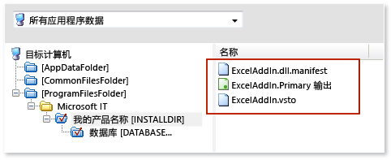
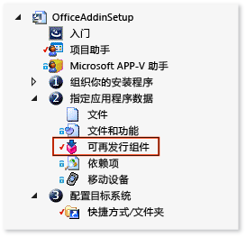

# <a name="deploy-an-office-solution-by-using-windows-installer"></a>使用 Windows Installer 部署 Office 解决方案
了解如何使用 [!INCLUDE[vs_dev12](../vsto/includes/vs-dev12-md.md)]为你的 Office 解决方案创建 Windows Installer。

通过使用 Visual Studio 创建 Windows Installer，你可以部署 Office 解决方案，该方案需要最终用户计算机上的管理员访问权限。 例如，只需使用此种文件安装一次解决方案，就可让计算机上的所有用户进行使用。 你也可以使用 ClickOnce 来部署 Office 解决方案，但必须针对计算机上的每个用户分别安装一次该解决方案。


## <a name="in-this-topic"></a>在本主题中

- [下载 VSTO 外接程序示例](#Download)

- [获取 InstallShield Limited Edition](#Obtain)

- [决定如何向解决方案授予信任](#ApplySecurity)

- [创建安装项目](#Create)

- [添加项目输出](#Add)

- [添加部署和应用程序清单](#AddD)

- [配置依赖组件为系统必备组件](#Configure)

- [指定在用户计算机上安装解决方案的位置](#Location)

- [配置 VSTO 外接程序](#ConfigureRegistry)

- [Configure a document-level customization](#ConfigureDocument)

- [Build the setup project](#Build)

有关如何使用 ClickOnce 部署 Office 解决方案的详细信息，请参阅[通过使用 ClickOnce 部署 Office 解决方案](../vsto/deploying-an-office-solution-by-using-clickonce.md)。

有关如何创建 Windows Installer 文件的使用信息[!INCLUDE[vs_dev10_long](../sharepoint/includes/vs-dev10-long-md.md)]，请参阅[部署 Visual Studio 2010 Tools for Office 解决方案使用 Windows 安装程序](http://go.microsoft.com/fwlink/?LinkId=201807)。


## <a name="Download"></a>下载示例
本主题参考以下可下载示例。


|示例<br /><br />|描述<br /><br />|
|----------|---------------|
|[ExcelAddIn](http://go.microsoft.com/fwlink/?LinkID=275492)<br /><br />|可在运行 32 位或 64 位版本 Office 的计算机上安装的 Excel VSTO 外接程序。<br /><br />|
|[ExcelWorkbook](http://go.microsoft.com/fwlink/?LinkID=275493)<br /><br />|可以在运行 32 位或 64 位版本 Office 的计算机上安装的 Excel 文档级自定义项。<br /><br />|

## <a name="ApplySecurity"></a>决定如何向解决方案授予信任
要让解决方案在用户计算机上运行，你必须以如下方式之一授予信任，或者用户必须在安装解决方案时响应信任提示。


- 使用能识别已知的受信任发布者的证书为清单签名。 有关详细信息，请参阅[信任该解决方案通过对应用程序和部署清单进行签名](../vsto/granting-trust-to-office-solutions.md#Signing)。

- 将解决方案安装到用户的计算机上的 Program Files 目录。

> [!NOTE]
> 对于文档级自定义项，还必须信任文档的位置。 有关详细信息，请参阅[向文档授予信任](../vsto/granting-trust-to-documents.md)。


## <a name="Obtain"></a>获取 InstallShield Limited Edition
可以使用 InstallShield limited Edition (ISLE)（安装 Visual Studio 后可免费使用）来创建 Windows Installer 文件。 ISLE 替代了 Visual Studio 早期版本中为安装和部署提供的项目模板功能。


### <a name="to-get-installshield-limited-edition"></a>获取 InstallShield Limited Edition

1. 在菜单栏上，依次选择“文件” > “新建” > “项目”。

   **“新建项目”** 对话框随即打开。

2. 在模板窗格中，展开 **“其他项目类”**，然后选择 **“安装和部署”** 模板。

3. 在 **“安装和部署”** 的属性列表中，选择 **“启用 InstallShield Limited Edition”**，然后选择 **“确定”** 按钮。

   此时将显示有关如何获取 InstallShield limited Edition 的信息页面。

4. 在该页上，选择 **“转到下载网站”** 链接。

5. 在 InstallShield limited Edition 下载页中，于相应字段中输入必需信息，然后选择 **“立即下载”** 链接。

   下载、安装并激活产品后，Visual Studio 中会显示 **“InstallShield Limited Edition 项目”** 模板。


## <a name="Create"></a>创建安装项目

1. 在 [!INCLUDE[vsprvs](../sharepoint/includes/vsprvs-md.md)]中，打开要部署的 Office 项目。

   与本主题相关的 VSTO 外接程序示例包含一个名为 **ExcelAddIn**的项目。 文档级自定义项示例包含一个名为 **ExcelWorkbook**的项目。 本主题将通过使用这两个名称之一来引用解决方案中的 Office 项目。

2. 在菜单栏上依次选择**文件** > **添加** > **新项目**。

   此时会打开 **“添加新项目”** 对话框。

3. 在模板窗格中，展开 **“其他项目类”**，然后选择 **“安装和部署”** 模板。

4. 在 **“安装和部署”** 的属性列表中，选择 **“InstallShield Limited Edition 项目”**，为项目命名，然后选择 **“确定”** 按钮。

   您创建的 InstallShield 安装项目显示在解决方案中。

   此主题中的示例包含一个名为 **“OfficeAddInSetup”** 的安装项目。 本主题将通过相同的名称来引用解决方案中的安装项目。


## <a name="Add"></a>添加项目输出
配置 **“OfficeAddInSetup”** 项目以包括 Office 项目的输出。 对于 VSTO 外接程序项目，项目输出中只有解决方案程序集。 对于文档级自定义项目，项目输出不仅包括解决方案程序集，还包括文档本身。


### <a name="to-add-the-project-output"></a>添加项目输出

1. 在 **“解决方案资源管理器”** 中，展开 **“OfficeAddInSetup”** 项目节点，然后选择 **“项目助手”** 文件，如下图所示。

   

2. 在菜单栏上依次选择**视图** > **打开**。

3. 在 **“项目助手”** 页下方，选择 **“应用程序文件”** 按钮，如下图所示。

   

4. 在 **“应用程序文件”** 页上，选择 **“添加项目输出”** 按钮。

5. 在 **“Visual Studio 输出选择器”** 对话框中，选中 **“主输出”** 复选框，然后选择 **“确定”** 按钮。


## <a name="AddD"></a>添加部署和应用程序清单

###
1. 在 **“应用程序文件”** 页上，选择 **“添加文件”** 按钮。

2. 在 **“打开”** 对话框中，浏览到 **ExcelAddIn** 项目的输出目录。

   通常，输出目录是项目根目录下的 **bin\release** 子文件夹，具体取决于选择的生成配置。

3. 在输出目录中，选择 **ExcelAddIn.vsto** 和 **ExcelAddIn.dll.manifest** 文件，然后选择 **“打开”** 按钮。

   如下图所示， **“应用程序文件”** 页现在包含项目输出文件、部署清单和应用程序清单。

   


## <a name="Configure"></a>配置依赖组件为系统必备组件
在安装应用程序中，不仅必须包括以下组件，还必须包括运行解决方案所需的所有其他组件。


- Office 解决方案所面向的 .NET Framework 版本。

- Microsoft Visual Studio 2010 Tools for Office Runtime。


### <a name="add-the-net-framework-4-or-the-net-framework-45-as-a-prerequisite"></a>添加.NET Framework 4 或.NET Framework 4.5 作为必备组件

1. 在 **“解决方案资源管理器”** 中，展开 **“OfficeAddInSetup”** 项目节点，展开 **“指定应用程序数据”** 节点，然后选择 **“可再发行文件”** ，如下图所示。

   

2. 在菜单栏上依次选择**视图** > **打开**。

   此时会打开 **“可再发行文件”** 页。

3. 在可再发行组件列表中，选中解决方案所针对 .NET Framework 版本的相应复选框。

   例如，如果你的解决方案面向 [!INCLUDE[net_v45](../vsto/includes/net-v45-md.md)]，则选择 **“Microsoft .NET Framework 4.5 Full”** 复选框。 可能显示对话框询问是否安装可再发行组件，InstallShield 要求执行此操作才能添加组件作为必备组件。 如果未显示此对话框中，您的计算机上已存在该组件。

4. 如果显示此对话框，请选择 **“否”** 按钮。


### <a name="AddToolsForOffice"></a>添加 Visual Studio 2010 Tools for Office Runtime
**“可再发行文件”** 页包含一个名为 **“Microsoft VSTO 2010 Runtime”** 的项，但是它引用的是运行时的较旧版本。 因此，可以手动创建引用最新版本的配置文件。 然后必须将此文件放入 **“可再发行文件”** 页上显示的所有其他项的配置文件所在的目录。


#### <a name="to-add-the-visual-studio-2010-tools-for-office-runtime-as-a-prerequisite"></a>若要将 Visual Studio 2010 Tools for Office 运行时添加的必备组件

1. 打开记事本，然后将以下 XML 复制粘贴到文本文件中。


   ```xml
   <?xml version="1.0" encoding="UTF-8"?>
   <SetupPrereq>
   <conditions>
       <condition Type="32" Comparison="2" Path="HKEY_LOCAL_MACHINE\SOFTWARE\Microsoft\VSTO Runtime Setup\v4R" FileName="Version" ReturnValue="10.0.50903" Bits="2"></condition>
   <condition Type="32" Comparison="2" Path="HKEY_LOCAL_MACHINE\SOFTWARE\Wow6432Node\Microsoft\VSTO Runtime Setup\v4R" FileName="Version" ReturnValue="10.0.50903" Bits="2"></condition>
   </conditions>
   <files>
       <file LocalFile="<ISProductFolder>\SetupPrerequisites\VSTOR\vstor_redist.exe" URL="http://download.microsoft.com/download/C/0/0/C001737F-822B-48C2-8F6A-CDE13B4B9E9C/vstor_redist.exe" CheckSum="88b8aa9e8c90818f98c80ac4dd998b88" FileSize=" 0,40117912"></file>
   </files>
   <execute file="vstor_redist.exe" returncodetoreboot="1641,3010" requiresmsiengine="1">
   </execute>
   <properties Id="{15965040-56BB-49B8-A88F-3525C48D9BA8}" Description="This prerequisite installs the most recent version of the Microsoft Visual Studio 2010 Tools for Office Runtime." >
   </properties>

   </SetupPrereq>
   ```

2. 在 Visual Studio 中生成 GUID。 在 **“工具”** 菜单上，选择 **“创建 GUID”**。

3. 在 **“GUID 生成器”** 程序中，选择 **“注册表格式”** 选项按钮，再选择 **“复制”** 按钮，然后选择 **“退出”** 按钮。

4. 在记事本中，将 GUID 粘贴到文本 **Your GUID goes here** 的位置，取代该文本。

   此时会打开 **&lt;properties&gt;** 元素类似于以下内容。


   ```xml
   <properties Id="{87989B73-21DC-4403-8FD1-0C68A41A6D8C}" Description="This prerequisite installs the most recent version of the Microsoft Visual Studio 2010 Tools for Office Runtime." >
   </properties>
   ```

5. 在记事本在菜单栏上依次选择**文件** > **保存**。

6. 在 **“另存为”** 对话框中，浏览到 **“桌面”** 文件夹。

7. 在中**另存为类型**列表中，选择**的所有文件 (&#42;。&#42;)**.

8. 在 **“文件名”** 框中，输入 **Visual Studio 2010 Tools for Office Runtime.prq**，然后选择 **“保存”** 按钮。

   > [!NOTE]
   >    确保在文件名末尾加上 **.prq** ，以将此文件指定为系统必备文件。

9. 关闭记事本。

10. 从你**桌面**文件夹中，复制*Visual Studio 2010 Tools for Office Runtime.prq*到以下目录之一在计算机上的文件。

   对于 32 位操作系统： *%ProgramFiles%\InstallShield\2013LE\SetupPrerequisites\\*

   对于 64 位操作系统： *%programfiles (x86) %\2013LE\SetupPrerequisites\\*

11. 在 InstallShield 项目的 **“可再发行组件”** 页上，选择 **“刷新”** 按钮刷新可再发行组件列表，如下图所示。

   

12. 在可再发行组件列表中，选中 **“Visual Studio 2010 Tools for Office Runtime”** 复选框。

   可能显示对话框询问是否要安装该可再发行组件。 如果未显示此对话框中，则可以跳到[指定你想要在用户计算机上安装解决方案](#Location)本主题的部分。

13. 如果显示此对话框，请选择 **“否”** 按钮。


## <a name="Location"></a>指定在用户计算机上安装解决方案的位置

1. 在 **“解决方案资源管理器”** 中，依次展开 **“OfficeAddInSetup”** 节点和 **“组织安装”** 节点，然后选择 **“常规信息”** 文件。

2. 在菜单栏上依次选择**视图** > **打开**。

3. 在属性列表中，选择 **“INSTALLDIR”** 属性旁的 **“浏览”** 按钮。

4. 在中**设置 INSTALLDIR**对话框框中，选择你想要安装该解决方案的用户的计算机上的文件夹。

   > [!NOTE]
   >    你还可以通过打开列表中的任何文件夹的快捷菜单，在 **“设置 INSTALLDIR”** 对话框中创建子目录。


## <a name="ConfigureRegistry"></a>配置 VSTO 外接程序
你可以指定是为计算机的所有用户安装 VSTO 外接程序（基于计算机），还是仅为执行安装的用户安装（基于用户）。

如果要支持基于计算机安装，请创建两个不同的安装程序。 可以根据用户运行的 Office 版本（32 位和 64 位）或 Windows 版本（32 位和 64 位）拆分安装程序。

采用基于用户的安装时，无论运行的是何种 Office 或 Windows 版本，都只需要一个安装程序。

> [!NOTE]
> 本节仅适用于要部署 VSTO 外接程序中。 如果你正在部署的文档级自定义项，则可以立即转到[配置文档级自定义](#ConfigureDocument)部分。


### <a name="to-specify-whether-you-want-to-support-per-user-or-per-computer-installations"></a>指定支持基于用户的安装还是支持基于计算机的安装

1. 在 **“解决方案资源管理器”** 中，依次展开 **“OfficeAddInSetup”** 项目节点和 **“组织安装”** 节点，然后选择 **“常规信息”** 文件。

2. 在菜单栏上依次选择**视图** > **打开**。

   此时会显示该安装项目的属性。

3. 在 **“AllUSERS”** 属性列表中，指定要为计算机的所有用户安装此解决方案，还是仅为某位用户安装此解决方案。

   若要安装 VSTO 外接程序的当前用户，请选择**ALLUSERS =""（每个用户安装）**。 若要为计算机的所有用户安装 VSTO 外接程序，请选择 **ALLUSERS=1**（基于计算机安装）。

   在下一步的过程中，将创建注册表项来支持 Office 应用程序能够发现和加载 VSTO 外接程序。 请参阅[VSTO 外接程序的注册表项](../vsto/registry-entries-for-vsto-add-ins.md)。


### <a name="to-create-registry-keys"></a>创建注册表项

1. 在 **“解决方案资源管理器”** 中，选择 **“项目助手”** 节点。

   在菜单栏上依次选择**视图** > **打开**。

2. 在 **“项目助手”** 页下方，选择 **“应用程序注册表”** 按钮，如下图所示。

   

   此时将显示 **“应用程序注册表项”** 页。

3. 在 **“是否希望配置应用程序将安装的注册表数据？”** 下，选择 **“是”** 选项按钮。

4. 在中**目标计算机的注册表视图**列表中，添加可支持你想要创建的安装程序类型的密钥层次结构。

   本节中配置的路径取决于你创建的是基于用户的安装程序还是基于计算机的安装程序。

   **基于用户的安装程序**

   **HKEY_CURRENT_USER\Software\Microsoft\Office\Excel\Addins\SampleCompany.ExcelAddIn**

   **根据 Office 版本创建的基于计算机的安装程序**


| Office 版本<br /><br /> | InstallShield 配置路径<br /><br /> |
|----------------------------| - |
| 32 位<br /><br /> | **HKEY_LOCAL_MACHINE\SOFTWARE(32-Bit)\Microsoft\Office\Excel\Addins\SampleCompany.ExcelAddIn**<br /><br /> |
| 64 位<br /><br /> | **HKEY_LOCAL_MACHINE\SOFTWARE(64-Bit)\Microsoft\Office\Excel\Addins\SampleCompany.ExcelAddIn**<br /><br /> |

   **根据 Windows 版本创建的基于计算机的安装程序**


| Windows 版本<br /><br /> | InstallShield 配置路径<br /><br /> |
|-----------------------------| - |
| 32 位<br /><br /> | **HKEY_LOCAL_MACHINE\SOFTWARE(32-Bit)\Microsoft\Office\Excel\Addins\SampleCompany.ExcelAddIn**<br /><br /> |
| 64 位<br /><br /> | **HKEY_LOCAL_MACHINE\SOFTWARE(32-Bit)\Microsoft\Office\Excel\Addins\SampleCompany.ExcelAddIn**<br /><br />**HKEY_LOCAL_MACHINE\SOFTWARE(64-Bit)\Microsoft\Office\Excel\Addins\SampleCompany.ExcelAddIn**<br /><br /> |

   > [!NOTE]
   >    64 位 Windows 的安装程序需要两个注册表路径，因为它是用户可以在运行 64 位 Windows 的计算机上运行 32 位和 64 位版本的 Office。

   > [!NOTE]
   >    最佳做法是，用公司名称作为开头来命名 VSTO 外接程序。 此约定会增加该密钥将是唯一的同时降低与 VSTO 外接程序从另一个供应商的发生冲突的可能性。 例如，具有相同名称的外接程序可能会覆盖彼此的注册表项。 此方法无法保证注册表项的唯一性，但可以减少潜在的名称冲突。

5. 创建密钥的层次结构后，打开快捷菜单**SampleCompany.ExcelAddIn**密钥，请选择**新建**，然后选择**字符串值**。

   新的字符串值将出现在**目标计算机的注册表数据**列表。 字符串值的名称会突出显示，以便你可以对其进行重命名。

6. 将该值重命名为 **Description**。

7. 重复此过程以创建以下值。


|值类型<br /><br />|名称<br /><br />|
|--------------|--------|
|“字符串值”<br /><br />|**FriendlyName**<br /><br />|
|DWORD 值<br /><br />|**LoadBehavior**<br /><br />|
|“字符串值”<br /><br />|**Manifest**<br /><br />|

8. 打开 **“Description”** 值的快捷菜单，然后选择 **“修改”**。

   出现 **“编辑数据”** 对话框。

9. 在“值数据”  文本框中，输入 **Excel Demo Add-In**，然后选择“确定”  按钮。

   当用户依次打开 Office 应用程序、“选项”  对话框，然后在“外接程序”  窗格中选择 VSTO 外接程序时，将会显示此说明。

10. 打开 **“FriendlyName”** 值的快捷菜单，然后选择 **“修改”**。

   出现 **“编辑数据”** 对话框。

11. 在“值数据”  文本框中，输入 **Excel Demo Add-In**，然后选择“确定”  按钮。

   此字符串会显示在 Office 应用程序的 **“COM 外接程序”** 对话框中。 默认情况下，该字符串的值为 VSTO 外接程序 ID。

12. 打开 **“LoadBehavior”** 值的快捷菜单，然后选择 **“修改”**。

   出现 **“编辑数据”** 对话框。

13. 在“值数据”  文本框中，输入 **3**，然后选择“确定”  按钮。

   应用程序启动时，值 3 会加载该 VSTO 外接程序。 有关 LoadBehavior 值的详细信息，请参阅[VSTO 外接程序的注册表项](../vsto/registry-entries-for-vsto-add-ins.md)。

14. 打开 **“Manifest”** 值的快捷菜单，然后选择 **“修改”**。

   出现 **“编辑数据”** 对话框。

15. 在“值数据”  文本框中，输入 **file:///[INSTALLDIR]ExcelAddIn.vsto|vstolocal**，然后选择“确定”  按钮。

   Visual Studio 2010 Tools for Office Runtime 会使用此路径查找部署清单。 此路径的 **[INSTALLDIR]** 部分是映射到 InstallShield 安装项目“常规信息”  属性页中的 **INSTALLDIR** 属性的宏。 此属性指定 VSTO 外接程序在目标计算机上的安装位置。 **|vstolocal** 后缀可确保从安装文件夹，而非 ClickOnce 缓存加载你的解决方案。

> [!IMPORTANT]
> 如果在 VSTO 外接程序中为 Outlook 创建自定义窗体区域，必须创建更多注册表项，outlook 中注册该区域。 有关详细信息，请参阅[注册表项的 Outlook 窗体区域](../vsto/registry-entries-for-vsto-add-ins.md#OutlookEntries)。


## <a name="ConfigureDocument"></a>Configure a document-level customization
本节仅适用于你在部署文档级自定义。 如果你正在部署 VSTO 外接程序中，您可以立即转到[生成安装项目](#Build)部分。

文档级自定义项不使用注册表项。 但自定义文档属性中会包含部署清单的位置。

若要修改自定义属性，您可以创建一个用于从文档中移除文档级自定义、 修改相应的属性，然后重新附加到文档的自定义程序。 然后，你可以创建运行该程序的自定义操作，并将该操作添加到你的安装项目中。

### <a name="to-create-a-program-that-modifies-document-properties"></a>创建修改文档属性的程序

1. 在菜单栏上依次选择**文件** > **添加** > **新项目**。

   此时，将显示 **“添加新项目”** 对话框。

2. 在模板窗格中，从你要使用的语言节点下选择 **“Windows”** 文件夹。

3. 在面向 **“Windows”** 的项目类型列表中，选择 **“控制台应用程序”** 模板。

4. 将项目命名为 **SetExcelDocumentProperties**，并选择“确定”  按钮。

5. 在 **“解决方案资源管理器”** 中，选择 **“显示所有文件”** 按钮，打开 **“SetExcelDocumentProperties”** 项目节点的快捷菜单，然后选择 **“添加引用”**。

6. 在 **“引用管理器”** 对话框中，选择 **“扩展”** 选项卡，选中以下程序集旁的复选框，然后选择 **“确定”** 按钮。


   - Microsoft.VisualStudio.Tools.Applications.Runtime

   - Microsoft.VisualStudio.Tools.Applications.ServerDocument

7. 在 **“解决方案资源管理器”** 中，选择 **“Program.cs”** 文件（针对 C# 应用程序）或 **“Module1.vb”** 文件（针对 Visual Basic 应用程序）。

8. 在菜单栏上依次选择**视图** > **打开**。

9. 将此文件的全部内容替换为以下代码。

[!code-vb[Trin_CustomAction#1](../vsto/codesnippet/VisualBasic/setexceldocumentproperties/module1.vb#1)]
[!code-csharp[Trin_CustomAction#1](../vsto/codesnippet/CSharp/setexceldocumentproperties/program.cs#1)]

10. 编译该项目。


### <a name="to-add-a-custom-action-that-runs-your-program"></a>添加运行程序的自定义操作

1. 在 **“解决方案资源管理器”** 中，展开 **“OfficeAddInSetup”** 项目节点，然后选择 **“项目助手”** 文件，如下图所示。

   

2. 在菜单栏上依次选择**视图** > **打开**。

3. 在 **“项目助手”** 页下方，选择 **“应用程序文件”** 按钮，如下图所示。

   

4. 在 **“应用程序文件”** 页上，选择 **“添加项目输出”** 按钮。

   此时会显示 **“Visual Studio 输出选择器”** 对话框。

5. 在 **“SetExcelDocumentProperties”** 节点下，选择 **“主输出”** 复选框，再选择 **“确定”** 按钮。

6. 在 **“解决方案资源管理器”** 中，于 **“OfficeAddInSetup”** 节点下，展开 **“定义安装要求和操作”** 节点，然后选择 **“自定义操作”** 文件夹。

7. 在菜单栏上依次选择**视图** > **打开**。

   屏幕旁边的窗格中会显示一个事件列表。

   > [!NOTE]
   >    此列表中只有少数事件可用于 InstallShield Limited Edition。 在此过程中，你将使用运行程序**安装程序成功完成之后对话框**事件。

8. 在事件列表中的 **“安装过程中的自定义操作”** 下，打开 **“‘安装程序成功完成之后’对话框”** 事件的快捷菜单，然后选择 **“新建 EXE”**。

   名为 **“NewCustomAction1”** 的自定义操作显示在 **“‘安装程序成功完成之后’对话框”** 事件下。 自定义操作的属性集会出现在事件旁边的窗格中。

   > [!IMPORTANT]
   >    事件列表中会出现两个 **“‘安装程序成功完成之后’对话框”** 事件。 确保选择显示在 **“安装过程中的自定义操作”** 节点之下的 **“‘安装程序成功完成之后’对话框”** 事件实例。

9. 在 **“源位置”** 属性列表中，选择 **“随产品安装”**。

10. 选择 **“文件名”** 属性旁边的 **“浏览”** 按钮。

11. 在 **“浏览目标文件”** 对话框中，浏览到 **“SetExcelDocumentProperties.Primary.output”** 文件，然后选择 **“打开”** 按钮。

    此文件的位置取决于为安装项目的 **“INSTALLDIR”** 属性指定的文件夹。 例如，如果你为名为 **“[PersonalFolder]DemoWorkbookApp”** 的文件夹设置该属性，则可以通过浏览到 **“[ProgramFilesFolder]\DemoWorkbookApp”** 找到 **“SetExcelDocumentProperties.Primary.output”** 文件。

    在下一步的几个步骤，将获取该文档的解决方案 ID，然后将该 ID 作为参数传递到控制台应用程序。 你还需要传递文档、 部署清单和文档集的位置。

12. 打开 **“ExcelWorkbook”** 项目的快捷菜单，然后根据操作系统选择 **“在 Windows 资源管理器中打开文件夹”** 或 **“在文件资源管理器中打开文件夹”** 。

    此时会打开包含解决方案的文件夹。

13. 在记事本中打开解决方案的项目文件。 对于 Visual Basic 项目文件的名称是*ExcelWorkbook.vbproj*。 对于 C# 项目，该文件的名称是*ExcelWorkbook.csproj*。

14. 在项目文件中，搜索**&lt;SolutionID&gt;** 元素中，将其值复制到剪贴板，，然后关闭记事本。

    可以将该值作为参数传递到控制台应用程序。

15. 在 **“NewCustomAction1”** 的属性页中，将 **“命令行”** 属性设置为以下文本行。


   ```cmd
   /assemblyLocation="[INSTALLDIR]ExcelWorkbook.dll" /deploymentManifestLocation="[INSTALLDIR]ExcelWorkbook.vsto" /documentLocation="[INSTALLDIR]ExcelWorkbook.xlsx" /solutionID="Your Solution ID"
   ```

16. 将 **Your Solution ID** 替换为复制到剪贴板中的解决方案 ID。

   > [!IMPORTANT]
   >    测试安装程序，以验证此自定义操作运行的控制台应用程序可以访问 [INSTALLDIR] 目录中的文档。 用户的计算机上的某些目录可能需要管理访问权限 （例如，Program Files 目录）。 如果正在将解决方案部署到需要管理员访问权限的目录，则应打开**属性**对话框中的*setup.exe*文件中，选择**的兼容性**选项卡，然后选择**以管理员身份运行此程序**再分发安装程序的复选框。 如果不希望用户能够使用管理权限运行安装程序，将 [INSTALLDIR] 属性设置为用户可能有权访问目录，如**文档**目录。 有关详细信息，请参阅[指定要在用户计算机上安装该解决方案](#Location)本主题的部分。


## <a name="Build"></a>Build the setup project

1. 在 **“解决方案资源管理器”** 中，展开 **“准备发布”** 节点，然后选择 **“发布”** 文件。

2. 在菜单栏上依次选择**视图** > **打开**。

   此时会在侧边窗格中打开 **“生成”** 资源管理器，便于你选择要创建的发布类型。

3. 在 **“生成”** 资源管理器中，选择 **“SingleImage”** 文件夹。

4. 在 **“生成”** 资源管理器旁边的窗格中，选择 **“Setup.exe”** 选项卡。

5. 在 **“Setup.exe”** 属性页中，从 **“InstallShield 系统必备组件位置”** 列表中，选择 **“从 Web 下载”**。

6. 在菜单栏上，依次选择“生成” > “Configuration Manager”。

7. 在 **“活动解决方案配置”** 列表中，选择 **“SingleImage”**。

8. 在 **“项目上下文”** 表中，从 **“OfficeAddInSetup”** 项目的 **“配置”** 列中选择 **“SingleImage”**，然后选择 **“关闭”** 按钮。

9. 在菜单栏上依次选择**构建** > **构建 officeaddinsetup**。

   在生成完成后，可以找到*setup.exe*的文件**officeaddinsetup**项目上的以下位置：<em>OfficeAddInSetupProjectRoot</em>**\OfficeAddInSetup\Express\SingleImage\DiskImages\DISK1\\**

## <a name="see-also"></a>请参阅

- [用于部署 office 解决方案必备组件](https://msdn.microsoft.com/library/9f672809-43a3-40a1-9057-397ce3b5126e)
- [部署 Office 解决方案](../vsto/deploying-an-office-solution.md)
- [VSTO 外接程序的注册表项](../vsto/registry-entries-for-vsto-add-ins.md)
- [自定义文档属性概述](../vsto/custom-document-properties-overview.md)
- [向 Office 解决方案授予信任](../vsto/granting-trust-to-office-solutions.md)
- [向文档授予信任](../vsto/granting-trust-to-documents.md)
- [部署 Visual Studio 2010 Tools for Office 解决方案使用 Windows 安装程序](http://go.microsoft.com/fwlink/?LinkId=201807)
