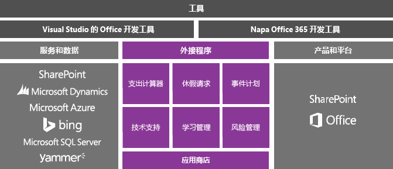
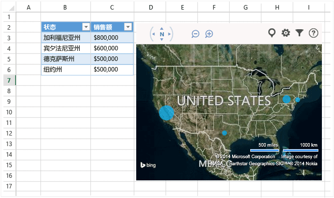
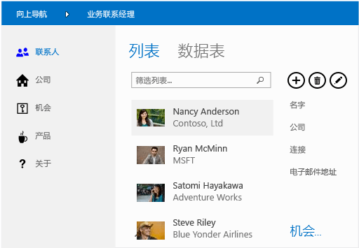

# Visual Studio 中的 office 和 SharePoint 开发
  可以通过创建用户从 [Office 应用商店](https://store.office.com/) 或组织目录中下载的轻量级应用程序或外接程序来扩展 Microsoft Office 和 SharePoint，或者通过创建用户在计算机上安装的基于 .NET Framework 的解决方案来扩展。  
  
 本主题内容：  
  
-   [创建 Office 和 SharePoint 的外接程序](#Apps)  
  
-   [创建一个 VSTO 外接程序](#Add-ins)  
  
-   [创建 SharePoint 解决方案](#Solutions)  
  
##   创建 Office 和 SharePoint 的外接程序  
 Office 2013 和 SharePoint 2013 引入了一个新的外接程序模型，有助于生成、分发和货币化那些扩展 Office 和 SharePoint 的外接程序。  这些外接程序可以在 Office 或 SharePoint 内在线运行，用户可以从多种设备上与它们进行交互。  
  
 了解如何使用新[Office 外接程序模型](/office/dev/add-ins/overview/office-add-ins)来扩展你的用户的 Office 体验。  
  
 这些加载项需求量小与 VSTO 外接程序和解决方案，相比，还可以通过使用几乎任何 web 编程 HTML5、 JavaScript、 CSS3 和 XML 等技术来生成。  若要开始，请使用 Visual Studio 中的 Office 开发人员工具，或使用代码名为“Napa Office 365 开发工具”的基于 Web 的轻量级工具，通过这些工具，可以创建项目、编写代码并在浏览器中运行外接程序。  
  
   
  
### 生成 Office 外接程序  
 若要扩展 Office 的功能，可生成 Office 外接程序。 它基本上是一个网页，如 Excel、 Word、 Outlook 和 PowerPoint 的 Office 应用程序中托管。 你的应用程序可以将功能添加到文档、工作表、电子邮件、约会、演示文稿和项目中。  
  
 你可以在 Office 应用商店出售你的应用程序。  借助 [Office 应用商店](https://store.office.com/) ，可以轻松将你的外接程序货币化、管理更新和跟踪遥测。 你也可以通过 SharePoint 中或 Exchange 服务器上的应用程序目录向用户发布你的应用程序。  
  
 以下适用于 Office 的应用程序会在 Bing 地图中显示工作表数据。  
  
   
  
 **了解更多信息**  
  
|到|查看|  
|--------|---------|  
|了解有关 Office 外接程序的详细信息，然后生成一个外接程序。|[Office 外接程序](/office/dev/add-ins/publish/publish)|  
|比较你可用于扩展 Office 的不同方式，然后决定应该使用应用还是 Office 外接程序。|[Office 外接程序、 VSTO 和 VBA 的路线图](https://blogs.msdn.microsoft.com/officeapps/2013/06/18/roadmap-for-apps-for-office-vsto-and-vba/)|  
  
### 生成 SharePoint 外接程序  
 若要为你的用户扩展 SharePoint，可生成 SharePoint 外接程序。 它基本上是小的、 易于使用的、 独立的应用程序，满足为用户或业务需求。  
  
 可以在 [Office 应用商店](https://store.office.com/)中出售适用于 SharePoint 的应用程序。 也可以通过 SharePoint 中的外接程序目录向用户发布你的外接程序。  网站所有者可以在其 SharePoint 网站上安装、升级和卸载你的外接程序，而无需场服务器或网站集管理员的帮助。  
  
 下面是可帮助用户管理商业伙伴的 SharePoint 相关应用的示例。  
  
   
  
 **了解更多信息**  
  
|到|查看|  
|--------|---------|  
|了解有关 SharePoint 外接程序的详细信息，然后生成一个外接程序。|[SharePoint 外接程序](/sharepoint/dev/sp-add-ins/sharepoint-add-ins)|  
|比较 SharePoint 外接程序和传统的 SharePoint 解决方案。|[SharePoint 外接程序与 SharePoint 解决方案相比较](/sharepoint/dev/general-development/sharepoint-server-application-lifecycle-management)|  
|选择是生成 SharePoint 外接程序还是 SharePoint 解决方案。|[SharePoint 外接程序和 SharePoint 解决方案之间做出决定](/sharepoint/dev/general-development/sharepoint-server-application-lifecycle-management)|
  
##   创建一个 VSTO 外接程序  
 创建一个 VSTO 外接程序以面向 Office 2007 或 Office 2010，或者除了可能与 Office 加载项扩展 Office 2013 和 Office 2016。VSTO 外接程序只能在桌面上运行。 用户必须安装 VSTO 外接程序，因此它们通常更加难以进行部署和支持。  但是，VSTO 外接程序可以与 Office 更紧密地集成。 例如，可以向 Office 功能区添加选项卡和控件并执行高级自动化任务，例如合并文档或修改图表。 你可以借助 .NET Framework 并使用 C# 和 Visual Basic 与 Office 对象进行交互。  
  
 下面是可以执行哪些一个 VSTO 外接程序示例。 该 VSTO 外接程序向 PowerPoint 添加了多个功能区控件、一个自定义任务窗格和一个对话框。  
  
   
  
 **了解更多信息**  
  
|到|读取|  
|--------|----------|  
|比较可用于扩展 Office 的不同方式，然后决定应该使用 VSTO 外接程序还是 Office 外接程序。|[Office 外接程序、 VSTO 和 VBA 的路线图](https://blogs.msdn.microsoft.com/officeapps/2013/06/18/roadmap-for-apps-for-office-vsto-and-vba/)|  
|创建一个 VSTO 外接程序。|[使用 Visual Studio 的 VSTO 外接程序生成](create-vsto-add-ins-for-office-by-using-visual-studio.md)|  
  
##   创建 SharePoint 解决方案  
 创建 SharePoint 解决方案以面向 SharePoint Foundation 2010 和 SharePoint Server 2010，或者可能采用 SharePoint 外接程序的其他方式扩展 SharePoint 2013 和 SharePoint 2016。  
  
 SharePoint 解决方案需要内部部署的 SharePoint 场服务器。 管理员必须安装它们，而且由于是在 SharePoint 中执行解决方案，因此可能会影响服务器性能。 但是，解决方案提供了对 SharePoint 对象更深层次的访问。 此外，当你构建 SharePoint 解决方案时，你可以借助 .NET Framework 并使用 C# 和 Visual Basic 与 SharePoint 对象进行交互。  
  
 **了解更多信息**  
  
|到|查看|  
|--------|---------|  
|比较 SharePoint 解决方案与 SharePoint 外接程序。|[SharePoint 外接程序与 SharePoint 解决方案相比较](/sharepoint/dev/general-development/sharepoint-server-application-lifecycle-management)|  
|创建 SharePoint 解决方案。|[创建 SharePoint 解决方案](../sharepoint/create-sharepoint-solutions.md)|  
