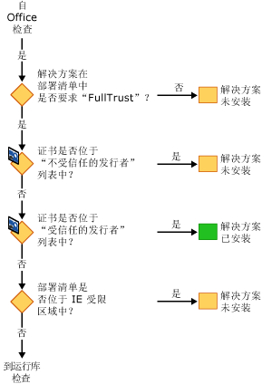
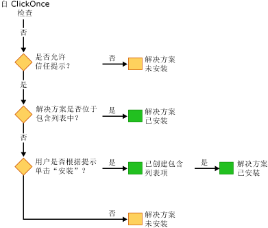

# 保护 Office 解决方案
  Office 解决方案的安全模型涉及多种技术： [!INCLUDE[vsto_runtime](../vsto/includes/vsto-runtime-md.md)]， [!INCLUDE[ndptecclick](../vsto/includes/ndptecclick-md.md)]，Microsoft Office 和 Internet Explorer 受限的站点区域中的信任中心。 以下各节介绍不同安全功能的工作方式：

- [向 Office 解决方案授予信任](#GrantingTrustToSolutions)

- [向文档授予信任](#GrantingTrustToDocuments)

- [使用 Windows Installer 时授予信任](#GrantingTrustWindowsInstaller)

- [有关 Office 解决方案的特定安全注意事项](#Security)

- [开发过程中的安全性](#SecurityDuringDeployment)

- [Visual Studio Tools for Office 运行时](#VisualStudioToolsForOfficeRuntime)

  [!INCLUDE[appliesto_all](../vsto/includes/appliesto-all-md.md)]

##   向 Office 解决方案授予信任
 向 Office 解决方案授予信任信任意味着修改每个最终用户的安全策略，以便基于以下证据信任 Office 解决方案：

- 用于对部署清单进行签名的证书。

- 部署清单的 URL。

  有关详细信息，请参阅[向 Office 解决方案授予信任](../vsto/granting-trust-to-office-solutions.md)。

##   向文档授予信任
 文档级自定义项要求文档位于被指定为可信位置的目录中。 有关详细信息，请参阅[向文档授予信任](../vsto/granting-trust-to-documents.md)。

##   使用 Windows Installer 时授予信任
 可使用 Windows Installer 创建 MSI 文件以将 Office 解决方案安装到 Program Files 目录，此操作需要管理员权限。 对于 Program Files 目录中的 Office 解决方案，Visual Studio 2010 Tools for Office 运行时考虑这些 Office 解决方案视为受信任和不显示 ClickOnce 信任提示。

##   有关 Office 解决方案的特定安全注意事项
 [!INCLUDE[net_v40_short](../sharepoint/includes/net-v40-short-md.md)]、[!INCLUDE[net_v45](../vsto/includes/net-v45-md.md)] 和 Microsoft Office 提供的安全功能有助保护 Office 解决方案免受各种可能的安全威胁。 有关详细信息，请参阅[Office 解决方案的特定安全注意事项](../vsto/specific-security-considerations-for-office-solutions.md)。

##   开发过程中的安全性
 为了简化开发过程，Visual Studio 设置了每次生成项目时在计算机上运行和调试解决方案所需的安全策略。 在某些方案中，可能需要采取其他安全措施来开发项目。

### 文档级解决方案
 如果要开发以下类型的项目，则必须将文档的完全限定的路径添加到 Microsoft Office 应用程序中的可信位置列表：

- 文档级解决方案，如位于网络文件共享 *\\\servername\sharename*。

- 使用 word 的文档级解决方案 *.doc*或 *.docm*文件。

  在向可信位置列表中添加文档位置时，请包括子目录，或者专门包括调试和生成文件夹。 有关详细信息，请参阅 Microsoft Office Online 帮助文章[创建、 删除或更改你的文件的受信任位置](https://support.office.com/article/Create-remove-or-change-a-trusted-location-for-your-files-f5151879-25ea-4998-80a5-4208b3540a62)。

### 临时证书
 如果不存在签名证书，则 Visual Studio 会创建一个临时证书。 只应在开发过程中使用此临时证书，在部署时应该购买正式证书。

 该临时证书是在首次生成 Office 项目之后生成的。 下次按**F5**，因为该项目标记为已更改时添加证书后，重新生成项目。

 在经过一段时间后，可能会有很多临时证书，因此应不定期地清除临时证书。

##   Visual Studio Tools for Office 运行时
 [!INCLUDE[vsto_runtime](../vsto/includes/vsto-runtime-md.md)]具有功能来验证身份的发布服务器和自定义项授予的权限。 它通过一系列安全检查来验证这些权限。

### 自定义加载过程中的安全性
 加载的文档级自定义项时，[!INCLUDE[vsto_runtime](../vsto/includes/vsto-runtime-md.md)]始终检查文档是否受信任的位置列表中。 此外，运行时检查解决方案是否在应用程序清单中请求 FullTrust。 在加载自定义项的过程中，它不再执行其他安全检查。

### 在安装过程中的安全检查的序列
 安装或更新 Office 解决方案时，[!INCLUDE[vsto_runtime](../vsto/includes/vsto-runtime-md.md)]会按特定顺序执行一组安全检查，以便做出信任决定。 仅当运行时确定解决方案受信任时，才会安装或更新解决方案。

 你可以开始安装过程中四种方法之一： 通过运行安装程序，通过打开部署清单，通过打开 Microsoft Office 应用程序主机，或通过运行*VSTOInstaller.exe*。

 第一项安全检查仅适用于文档级解决方案。 文档级解决方案的文档必须位于可信位置。 如果该文档位于远程网络文件共享上，或者具有 *.doc*或 *.docm*文件扩展名，必须将该文档的位置添加到受信任的位置列表。 有关详细信息，请参阅[向文档授予信任](../vsto/granting-trust-to-documents.md)。

 

 接下来的一组安全检查来自于 [!INCLUDE[vsto_runtime](../vsto/includes/vsto-runtime-md.md)] 和 ClickOnce。 若要通过这些检查，Office 解决方案必须请求 FullTrust 权限、 使用不受信任的发布服务器列表中未列出的证书进行签名并在不是在 Internet Explorer 受限区域中的位置。 如果证书是受信任的发布服务器列表中，然后立即安装解决方案。 否则，如果解决方案通过所有这些检查，则会继续进行最后一组检查。

 

 如果[!INCLUDE[ndptecclick](../vsto/includes/ndptecclick-md.md)]允许信任提示并且解决方案还未被授予信任，运行时将允许最终用户做出信任决定。 如果用户向解决方案授予信任，则会向用户包含列表中添加一项。 用户包含列表中的所有解决方案都具有完全信任，可以安装和运行。

 从 Visual Studio 2010 开始，如果使用 Windows Installer (MSI) 将 Office 解决方案安装到 Program Files 目录，则会跳过包含列表。 有关详细信息，请参阅[使用包含列表信任 Office 解决方案](../vsto/trusting-office-solutions-by-using-inclusion-lists.md)。

 

## 请参阅

- [向 Office 解决方案授予信任](../vsto/granting-trust-to-office-solutions.md)
- [向文档授予信任](../vsto/granting-trust-to-documents.md)
- [使用包含列表信任 Office 解决方案](../vsto/trusting-office-solutions-by-using-inclusion-lists.md)
- [如何：配置包含列表安全性](../vsto/how-to-configure-inclusion-list-security.md)
- [如何：对 Office 解决方案进行签名](../vsto/how-to-sign-office-solutions.md)
- [Office 解决方案安全性疑难解答](../vsto/troubleshooting-office-solution-security.md)
- [Office 解决方案的应用程序清单](../vsto/application-manifests-for-office-solutions.md)
- [Office 解决方案的部署清单](../vsto/deployment-manifests-for-office-solutions.md)
- [ClickOnce 参考](../deployment/clickonce-reference.md)
- [部署 Office 解决方案](../vsto/deploying-an-office-solution.md)
