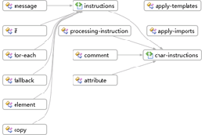

# 如何：使用图形视图获取架构集的概览

本主题介绍如何使用[图形视图](../xml-tools/graph-view.md)若要查看架构集以及节点之间的关系中的节点的高级视图。

## 创建新的 XSD 文件并显示内容模型视图中的根元素

1.  创建新的 XML 架构文件并将文件保存为 Relationships.xsd。

2.  单击**使用 XML 编辑器查看和编辑基础 XML 架构文件**起始视图上的链接。

3.  复制 XML 架构示例代码从[示例 XML 架构： 关系](../xml-tools/sample-xsd-file-relationships.md)并将其以替换默认情况下，已将它们添加到新 XSD 文件的代码粘贴。

4.  右键单击任意位置在 XML 编辑器中，然后选择**视图设计器**。

5.  从 XSD 工具栏选择图形视图。

6.  选择**架构集**中的 XML 架构资源管理器和将该节点拖图形视图的设计图面上的节点。 您应当会看到所有全局节点，以及连接有关系节点的箭头。

     

7.  单击设计图面上的任何节点并查看痕迹栏，以了解所选节点在架构集中的位置。

8.  右击设计图面并选择上的任何元素节点**生成示例 XML**若要查看 XML 实例文档。